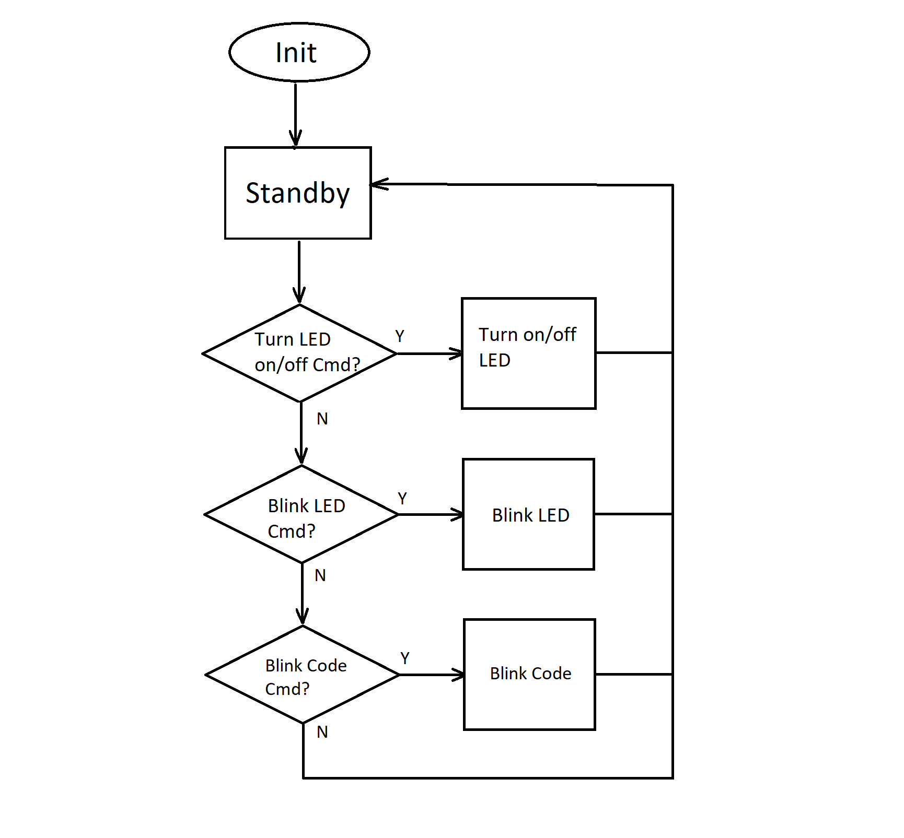

# Bluetooth&reg; LE LED Utility

## Overview
This utility provides LED driver functions.

## Requirements
The led_lib_init() function with proper parameter must be called first before any other functions can be called in this utility.

## Detailed Design and Review

## Repo staging
