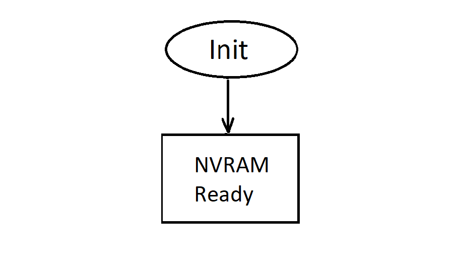

# Bluetooth&reg; LE NVRAM Utility

## Overview
This utility provides NVRAM access functions.

## Requirements
When NULL parameter is passed in nvram_init() function, the default NVRAM access is used. The nvram_init() function must be called first before NVRAM read or write function can be called.

## Detailed Design and Review

## Repo staging
